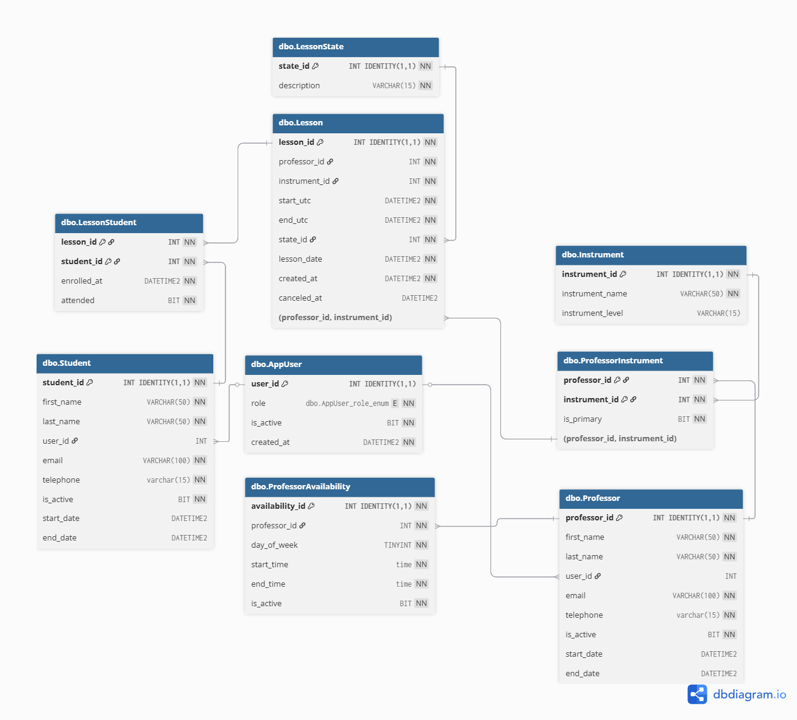

# Gestor de Clases - Estructura de la Base de Datos 🎵

## 🗄️Estructura de la Base de Datos

### Diagrama Entidad-Relación


### Tablas Principales

#### 👥 Gestión de Usuarios
- **`AppUser`**: Usuarios del sistema con roles (Admin/Professor/Student)
- **`Student`**: Información de estudiantes
- **`Professor`**: Información de profesores

#### 🎼 Gestión Académica
- **`Instrument`**: Catálogo de instrumentos musicales
- **`ProfessorInstrument`**: Relación N:M entre profesores e instrumentos
- **`ProfessorAvailability`**: Horarios disponibles de cada profesor

#### 📚 Gestión de Clases
- **`LessonState`**: Estados posibles de las clases
- **`Lesson`**: Clases programadas
- **`LessonStudent`**: Inscripciones de estudiantes a clases (relación N:M para permitir clases grupales)

## 🔧 Tecnologías

- **Base de Datos**: SQL Server
- **Lenguaje**: T-SQL para scripts de creación
- **Características**: 
  - Transacciones ACID
  - Índices optimizados para consultas frecuentes
  - Restricciones de integridad referencial
  - Validaciones a nivel de BD

## 🚀 Instalación y Configuración

### Prerrequisitos
- SQL Server 2016 o superior
- Permisos de administrador en la base de datos

### Pasos de Instalación

1. **Clonar el repositorio**
   ```bash
   git clone [https://github.com/maurocatania/portfolio.git]
   ```

2. **Crear la base de datos**
   - Ejecutar el script [01-create-tables.sql](db/database-setup.sql) en SQL Server Management Studio en una BD previamente creada
   - O usar la línea de comandos:
   ```bash
   sqlcmd -S [servidor] -d [base_de_datos] -i database-setup.sql
   ```

3. **Verificar la instalación**
   - Confirmar que todas las tablas se crearon correctamente
   - Verificar que los índices y restricciones estén aplicados

## 📊 Ejemplos de Uso

### Datos de Ejemplo

```sql
-- Crear un profesor de piano
INSERT INTO dbo.Professor (first_name, last_name, email, telephone, is_active)
VALUES ('Juan', 'Pérez', 'juan.perez@musica.com', '555-0123', 1);

-- Asociar el profesor con el piano
INSERT INTO dbo.ProfessorInstrument (professor_id, instrument_id, is_primary)
VALUES (1, 1, 1);

-- Definir disponibilidad (Lunes 9:00-17:00)
INSERT INTO dbo.ProfessorAvailability (professor_id, day_of_week, start_time, end_time, is_active)
VALUES (1, 1, '09:00', '17:00', 1);
```

### Consultas Comunes

```sql
-- Ver profesores y sus instrumentos
SELECT 
    p.first_name + ' ' + p.last_name AS profesor,
    i.instrument_name AS instrumento,
    pi.is_primary AS es_primario
FROM Professor p
JOIN ProfessorInstrument pi ON p.professor_id = pi.professor_id
JOIN Instrument i ON pi.instrument_id = i.instrument_id
WHERE p.is_active = 1;

-- Clases programadas para hoy
SELECT 
    l.lesson_id,
    p.first_name + ' ' + p.last_name AS profesor,
    i.instrument_name AS instrumento,
    l.start_utc,
    l.end_utc,
    ls.description AS estado,
    l.lesson_capacity AS cupo
FROM Lesson l
JOIN Professor p ON l.professor_id = p.professor_id
JOIN Instrument i ON l.instrument_id = i.instrument_id
JOIN LessonState ls ON l.state_id = ls.state_id
WHERE CAST(l.lesson_date AS DATE) = CAST(GETDATE() AS DATE);
```

## 🔍 Características Técnicas

### Índices Optimizados
- Búsquedas por profesor y fecha
- Consultas de disponibilidad
- Relaciones entre tablas

### Validaciones Implementadas
- ✅Emails únicos para profesores y estudiantes
- ✅Horarios de clases válidos (fin > inicio)
- ✅Fechas de actividad coherentes
- ✅Profesores solo enseñan instrumentos registrados
- ✅Un instrumento primario por profesor máximo
- ✅Los únicos roles permitidos son: Admin, Professor y Student
- ✅Las clases tienen un cupo máximo, que es validado tanto en BD (trigger) como en backend.

### Integridad Referencial
- Eliminación en cascada para inscripciones
- Prevención de eliminación de datos con dependencias
- Relaciones N:M correctamente implementadas

## 🐛 Problemas Conocidos

- La validación de solapamiento de horarios se maneja en la capa de aplicación
- Las zonas horarias deben manejarse cuidadosamente (UTC en BD)

## 📞 Contacto y Soporte

Si tienes preguntas o encuentras algún problema:
- Crear un issue en GitHub
- Contactar al equipo de desarrollo

## 📄 Licencia

[Especificar la licencia de tu proyecto]

---

⭐Si este proyecto te resulta útil, ¡no olvides darle una estrella en GitHub!
